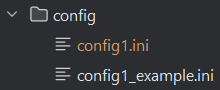
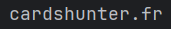

# Pokem_Buyer_Bot

# Introduction
This project is a Pokem buying bot designed to purchase Pokem products licence faster than other buyers.

Here’s what it does during a standard purchase:
- Logs in with the selected account on the merchant Pokem website
- Continuously checks for the availability of the target product (while not logged in)
- Once the product is available, adds it to the cart (while logged in)
- Verifies the cart
- Automatically fills in the checkout form
- Selects the delivery method (pickup point option works!)
- Places the order

(Note: To ensure that only my friends and I use this bot, the word "poke e mon" is referred to as "pokem" throughout the repository to avoid being indexed on GitHub. The project remains public so my friends can access it.)

# Create a Config File
The config file is the storage space that contains all your personal information. It is the only file you need to update before running the program.  
You’ll find an example config file in the **pokem_buyer_bot/config** folder.

### File Naming
- Copy and paste the file `config/config1_example.ini` and rename it to `config/config1.ini`.

### Create a Personal Account
- You need to go to the Pokem store:  
  
to create a personal account. Make sure to save the username and password you created.

### Fill in the Config File
We recommend using the `config1_example.ini` file as a reference to help you correctly fill out the fields in your personal `config1.ini` file.

Some fields are more complex and require additional explanation to be filled out properly:

- URLPRODUCTCARD: Highly anticipated products often have product pages available on the site long before they go on sale. You need to browse the Pokem store to find the page of the desired product. Then, paste the URL of the product page you wish to purchase here.

- ADRESSE_CODE_POSTAL_ZONE_POINT_RETRAIT: (only if you want to use a pickup point for delivery) Enter a postal address located near the pickup points you want to use.

- NOM_ZONE_POINT_RELAIS: This field is the name of your preferred pickup point. To find out the name of available pickup points at your chosen address, run the script file **choose_pickup_point_one_config.bat** (see more details in the chapter _Launching the Program Using Script Files_). Then, enter the desired pickup point name in this field.

### Create Multiple Config Files
It is possible to create multiple config files.  
These files should be named `config1.ini`, `config2.ini`, `config3.ini`, etc.

Having multiple config files allows you to **purchase several similar products using different accounts**, despite the store’s limitation of one product per account.

## Launching the Program Using Script Files

To make things easier, all the bot’s actions have been automated with `.bat` script files. This means you just need to double-click these `.bat` files to run the bot — no manual commands needed. (Note: these scripts only work on Windows.)

Here’s a quick overview of what each script does:

- **choose_pickup_point_one_config.bat**  
  Runs the bot using a selected config file, stopping right before the pickup point selection. This helps you find and set the correct pickup point name (`NOM_ZONE_POINT_RELAIS`) in your config.

- **test_one_config.bat**  
  Runs the bot with a single config file and stops at the purchase button. Useful for testing your setup. (The program **never** completes the purchase).

- **test_all_config.bat**  
  Runs the bot for all your config files, stopping at the purchase button for each—again. Useful for testing your setups. (The program **never** completes the purchases).

- **run_one_config.bat**  
  Runs the bot with a single config file and attempts to purchase the product according to that config.

- **run_all_config.bat**  
  Runs the bot for all your config files, trying to purchase the product with each one.

This setup lets you easily test and run the bot with different accounts and settings by simply choosing the right script.
